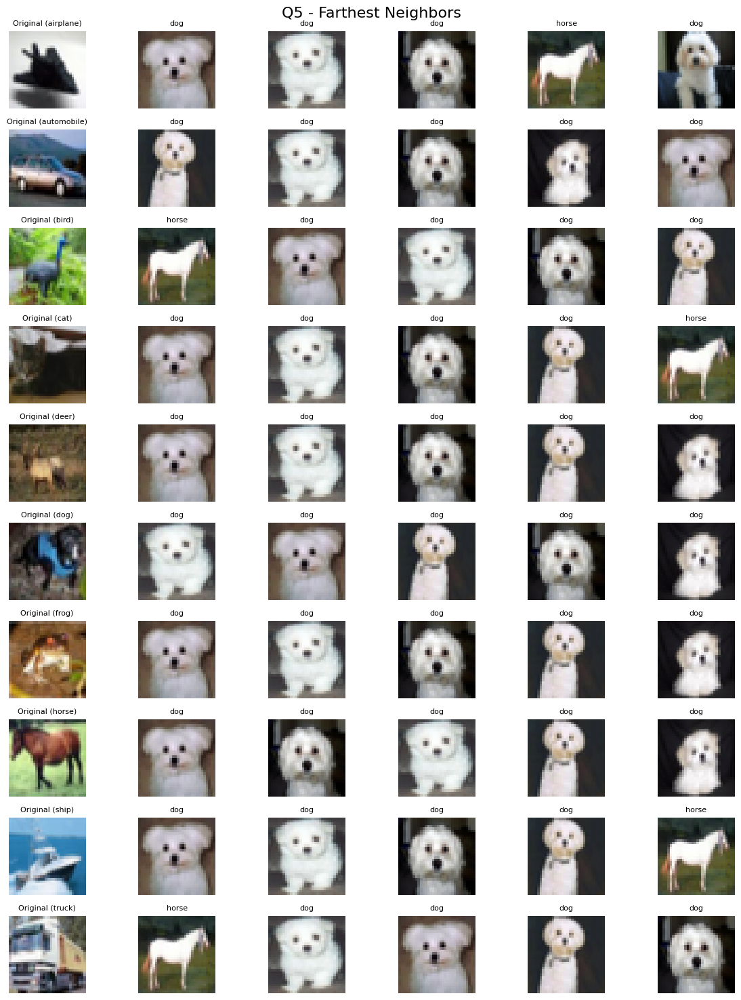

AML(67912) - Ex 3 report

Part I - VICReg to Laplacian Eigenmaps

Training: The 3 components of the training loss over the batches:

Test losses over the epochs:

The test invariance loss is identically 0 as the test transformation is deterministic.

PCA vs. T-SNE Visualizations. PCA and t-SNE visualization of all the representations of test images under the model:

The PCA representation shows that the model succeeded to cluster classes relatively successfully, but all the classes are entangled together. Since the model is trained to scatter the representations among all the 128 dimensions, projecting the data into 2 dimensions is not representative enough.The t-SNE representation is much better and shows good clustering together with (relatively) good class separation, due to the fact that it tries to preserve local structures together with the global one. VICReg seems to have captured the class information accurately, since similar classes are clustered next to each other (truck-ship-automobile-airplane on the right side of the plot, animals on the left). The class ‘bird’ is scattered inside all the other animal classes, so apparently its information was harder to capture.The two most mutually entangled classes are cat and dog, which is expected as their body structures/positions/colors are close to each other.

Linear probing: Accuracy reached on the training and test set at the beginning and the end of the run:Epoch 1/30, Train Accuracy: 0.7071Epoch 1/30, Test Accuracy: 0.7255Epoch 30/30, Train Accuracy: 0.7594Epoch 30/30, Test Accuracy: 0.7532

Ablation 1 - No Variance Term

The optimization seems to have collapsed due to the ablation of the variance term. The 2 principal components seem to have a pretty high variance and also a large negative mutual covariance (though it is a bit hard to tell what is the density of the points near (0,0)). However the overall covariance loss (computed during training) is very low, which hints that most of the dimensions have constant values and that the representations lie on a very low-dimensional manifold. This also appears from the t-SNE representation.The ablation of the variance had an impact also on the covariance loss, which could not decorrelate dimensions with constant values. The result is a complete collapse of the model and we see that all the classes are completely entangled into each other and not distinguishable. This is coherent with the result of the linear probing: Epoch 30/30, Train Accuracy: 0.1670Epoch 30/30, Test Accuracy: 0.1748,which is slightly better than a random guess but still very poor.

Ablation 2 - No generated neighbors

I trained the model using neighbors identified by the first model, for 10 epochs, and then trained a linear probing layer for 30 epochs. The test accuracy I got at epoch 30 is  0.7019, which is slightly less than the first model but not dramatically.Out of curiosity I plotted PCA and t-SNE for that model:

The clustering of t-SNE does not look as good as the first model, but is still very acceptable.This model was trained using representations computed by the first model (which showed an acceptable accuracy), so we compensated for the absence of generated neighbors by using vector representations.The first model had the hard task of representing visual features (images) as vectors on a 128-dimensional space based only on visual augmentations/features. The latest one was based on already learned “vectorial” features, which are way easier to work with for neural networks.

Ablation 3 - Laplacian Eigenmaps.

The VICReg model seems more effective for downstream object classification, for two main reasons:

The t-SNE visualization for Laplacian Eigenmaps does not show any kind of clustering, the classes are completely mixed together, while t-SNE in Q2 showed pretty satisfying clustering and even a good classification accuracy in Q3. I think this is due to the fact that L2 distance for images is more impacted by the dominating colors than by semantic features.

Laplacian Eigenmaps are optimized without amortization on the training set, hence will not be useful for classifying images from the test set.

Retrieval Evaluation

VICReg nearest neighbors:

We see that VICReg performed very well, except for the airplane. The reason is that the chosen airplane picture is clearly not a “typical” airplane image, hence is confused with similarly shaped and colored images. For other classes, the images are confused only when an image from another class is very similar. Note also that horse, ship, truck and automobile classes are very well separated in t-SNE representation, and we see here all their neighbors are correct, which is coherent.

VICReg farthest points:

I don’t see anything particularly characterizing the horse, dog and automobile image that recurrently appear as the farthest image (the white color is dominating but it is the case for other images also). We can remark that the images seen here belong to the ‘outer’ classes on t-SNE representation, which is nonetheless coherent.

VICReg without generated neighbors (Q5), nearest neighbors:

The results are pretty similar to the Q1 model, outperforms it on cat class, and is worse for the ‘bird’ class. Globally those are expected results, images that are considered as close for the first model are explicitly optimized to be also close for the Q5 model.

VICReg without generated neighbors (Q5) farthest points:We can see the same images that were considered outliers in the first model, have the same status now, with a larger distance for the cute white dogs. This strengthens the impression that both models captured similar features, but the second one did not get really ‘diverse’ far images.

Overall, after analyzing all the results, I would say VICReg without generated neighbors is better at keeping semantically close points together, as it was explicitly trained to do so, and classic VICReg is better at keeping far images far away from each other.

Part II - Anomaly Detection

Anomaly detection: I computed all the inverse density scores as required.

ROC Curve: ROC curve of both methods for anomaly detection:

Q5 model is better: The Q1 model encourages invariance through strong augmentations, promoting class separation but potentially flattening the data manifold, making it harder to distinguish anomalies. In contrast, Q5 leverages real nearest neighbors, preserving the local structure of the CIFAR10 training distribution and resulting in a more faithful representation of normal data.

Ambiguity of anomaly detection:

Most anomalous images for Q1 model:

This model flags various versions of the digit '8' as the most anomalous. The digit ‘8’ has a relatively complex structure (two loops) compared to other MNIST digits, and its visual appearance can somewhat resemble CIFAR-10 objects in terms of global shape or texture, especially after resizing and normalization. It is likely that the model, having learned invariances from augmented CIFAR-10 samples, finds these structured shapes unusual compared to natural images and identifies them as outliers due to their synthetic and “unnatural” character.

Most anomalous images for Q5 model:

This model marks mostly digit '4' instances as anomalous. Digit ‘4' is visually much simpler than the digit ‘8’. Without the generated neighbors helping to regularize or enrich the embedding space with more semantically diverse neighbors, the model becomes more sensitive to the lack of structure and detail, flagging these simpler images as highly anomalous.

Part III - Clustering

1 and 2. Clustering and visualizing:

VICReg:

VICReg without generated neighbors:

It appears that VICReg separates classes better, but in term of pure clustering, VICReg without generated neighbors gives much nicer results.

3. Quantitative analysis

VICReg silhouette score: 0.0870

VICReg no gen neighbors silhouette score: 0.1141

These results are extremely surprising, the clustering being apparently acceptable, such low scores are not to be expected. I used sklean silhouette loss, so I don’t think there is an error in the formula, hence I have no clue how to interpret those scores.
